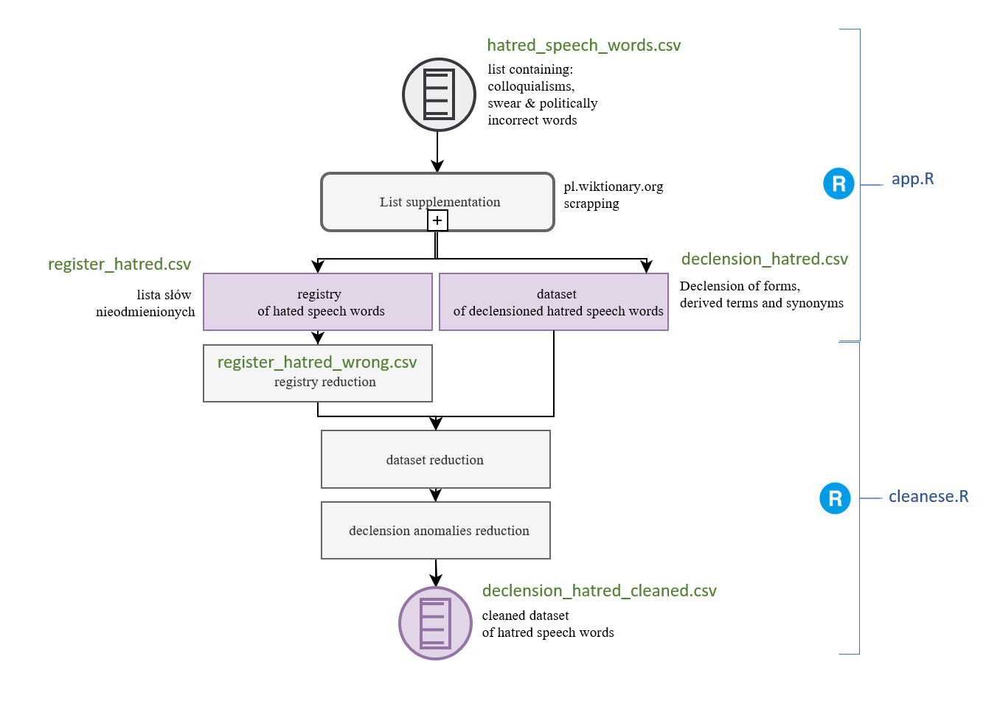
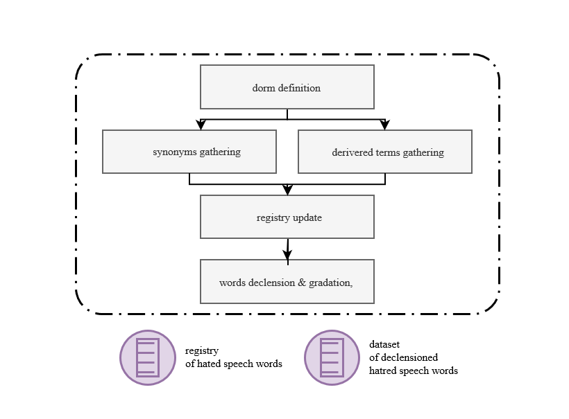

Polish swear words gathering
================
Mateusz Kostrzewski
March 2, 2021

#### Kaggle: [polish-negative-words](https://www.kaggle.com/mateuszkostrzewski/polish-negative-words)

## Introduction

The author’s method is based on finding for each word a table of
variations and a set of derived terms or synonyms. Firstly, the register
with synonyms and related words is created. The words are then
declensioned according to their form. Manual rejection of words
incorrectly assigned is required in order to remove them from the final
file. The process is shown in **Diag.1**.

 **Diag.1. Process of gathering negative
words dataset**

## Tools

The [rvest](https://github.com/tidyverse/rvest) library and Google
Chrome developer tools were used for this task. The
[pl.wikitionary.org](pl.wikitionary.org) elements were examined. XPaths
to html objects (nodes) were read. Nodes store information such as form,
tables of varieties by numbers, degrees and cases, and lists of related
words and synonyms. There was need of using regular expressions for text
reduction. Text modification was possible with using the following
libraries: [magrittr](https://github.com/tidyverse/magrittr),
[tm](https://github.com/cran/tm) and
[reshape2](https://github.com/hadley/reshape)

Essential in handling http requests is the use of exceptions. It is
possible that an endpoint with a particular word has not been created.
In order to prevent the server from suspecting the use of a DOS attack,
the script waits 1.5 seconds after each request.

## Input list supplementation

The script loads a file **hatred\_speech\_words.csv** containing a list
of words. For each word, the .html file is downloaded from the
[pl.wikitionary.org](pl.wikitionary.org) subpage. A registry is created
(**OutputData/register\_hatred.csv**) supplemented with synonyms and
related words, for which words with similar meaning are also searched.
The process is repeated until the fixed number of iterations is reached.
A single word in the register is distinguished based on its individual
multi-column identifier. The words are then declensioned. The subprocess
is shown in **Diag.2**.

**Diag.2. Process of input list supplementation**

## Data cleaning

The registry requires manual rejection of words incorrectly assigned as
a synonym, variant, or derivered term and removing them from the final
file. **Cleanese/cleanese.R** filters out misread word texts and
discards all variations based on the modified registry containing the
words determined as incorrect. The result file is
**Cleanese/declension\_hatred\_cleaned.csv**. Before running the script,
the registry file and variations should be moved to the **Cleanese/**
folder.

## License

MIT License
