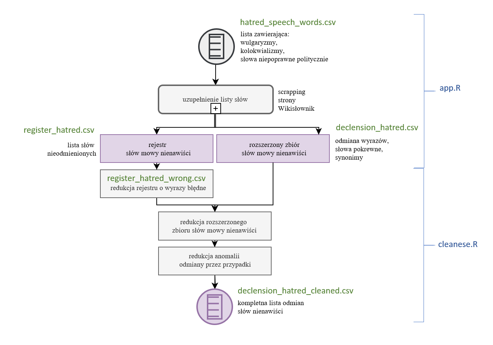
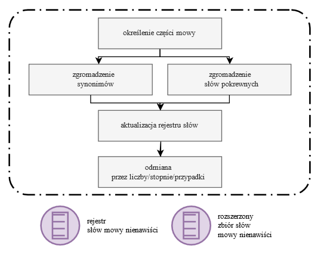

Gromadzenie negatywnych słów
================
Mateusz Kostrzewski
March 2, 2021

## Wprowadzenie

Autorska metoda opiera się na znajdowaniu dla każdego słowa tablic
odmian i zbioru słów o podobnym znaczeniu. Na podstawie listy
nieprzyzwoitych słów tworzony jest rejestr uzupełniony o synonimy i
wyrazy pokrewne. Następnie wyrazy są odmieniane w zależności od części
mowy. Rejestr wymaga ręcznego odrzucenia wyrazów błędnie przypisanych
jako synonim, odmiana lub wyraz pokrewny i usunięcia ich z finalnego
pliku. Proces przedstawiono na **Diag.1**.

 **Diag.1. Proces gromadzenia
negatywnych słów**

## Zastosowane narzędzia

Do tego zadania wykorzystano bibliotekę
[rvest](https://github.com/tidyverse/rvest) i narzędzia deweloperskie
przeglądarki Google Chrome. Zbadano elementy witryny
[pl.wikitionary.org](pl.wikitionary.org) i odczytano ścieżki XPath do
obiektów (węzłów) html przechowujących informacje tj. część mowy, tabele
odmian przez liczby, stopnie i przypadki oraz listy słów pokrewnych i
synonimów. Skorzystano z wyrażeń regularnych do redukcji tekstu.
Modyfikacja tekstu możliwa dzięki bibliotekom:
[magrittr](https://github.com/tidyverse/magrittr),
[tm](https://github.com/cran/tm) i
[reshape2](https://github.com/hadley/reshape)

Koniecznym elementem obsługi żądań http jest zastosowanie wyjątków,
ponieważ istnieje możliwość, że podstrona ze słowem nie została
utworzona. W celu uniknięcia podejrzeń serwera o stosowanie ataku DOS
skrypt odczekuje 1,5 sekundy po każdym żądaniu.

## Uzupełnienie zbioru słów wejściowych

Skrypt wczytuje plik **hatred\_speech\_words.csv** zawierający listę
słów nieprzyzwoitych. Dla każdego wyrazu pobierany jest plik .html
opisującej go podstrony [pl.wikitionary.org](pl.wikitionary.org).
Tworzony jest rejestr (**OutputData/register\_hatred.csv**) uzupełniony
o synonimy i wyrazy pokrewne, dla których również wyszukuje się słowa o
podobnym znaczeniu. Proces jest powtarzany w zależności od ustalonej
liczby iteracji. Pojedyncze słowo w rejestrze jest rozróżniane na
podstawie indywidualnego, wielokolumnowego identyfikatora. Następnie
wyrazy są odmieniane w zależności od części mowy. Podproces
przedstawiono na **Diag.2**.

**Diag.2. Proces uzupełnienia zbioru słów wejściowych**

## Oczyszczenie zbioru

Rejestr wymaga ręcznego odrzucenia wyrazów błędnie przypisanych jako
synonim, odmiana lub wyraz pokrewny i usunięcia ich z finalnego pliku.
**Cleanese/cleanese.R** filtruje błędnie odczytane teksty słów i odrzuca
wszystkie odmiany na podstawie zmodyfikowanego rejestru, zawierającego
słowa uznane za błędne. Powstaje plik
**Cleanese/declension\_hatred\_cleaned.csv**. Przed uruchomieniem
skryptu plik rejestru i odmian powinny zostać przeniesione do folderu
**Cleanese/**

## License

MIT License
